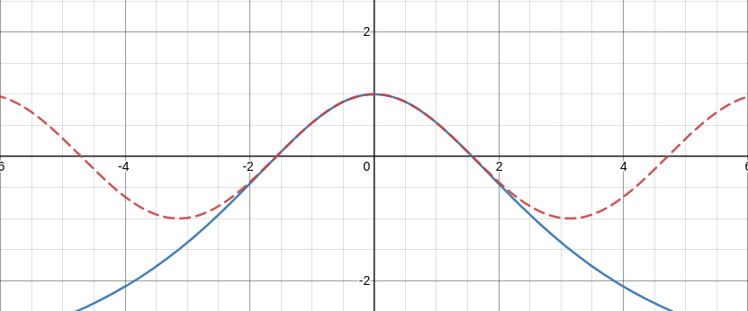
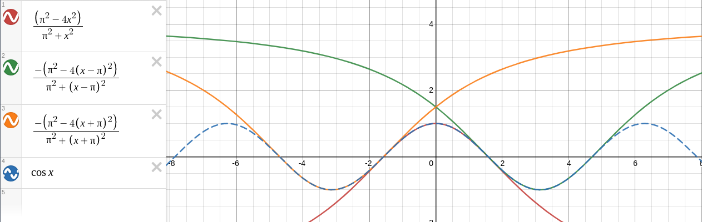
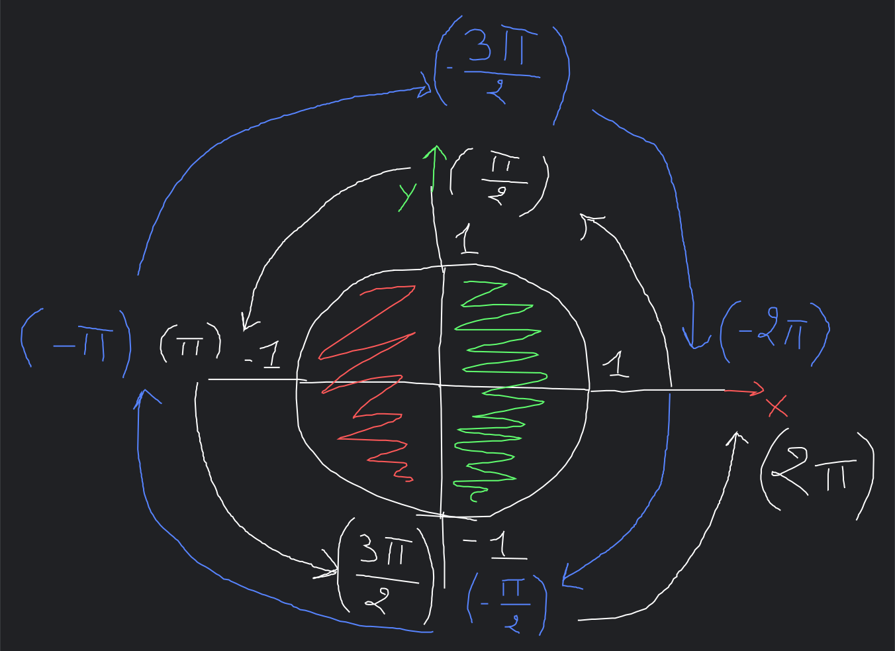
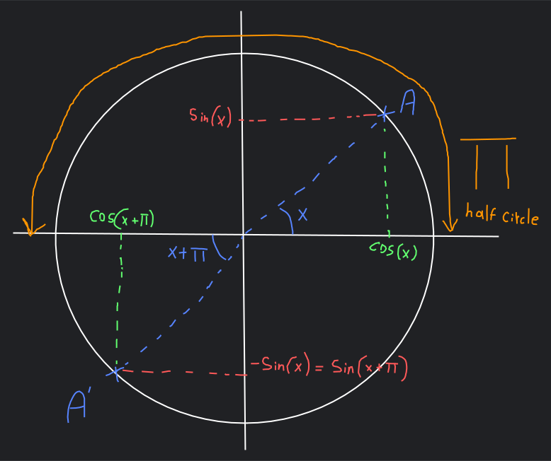
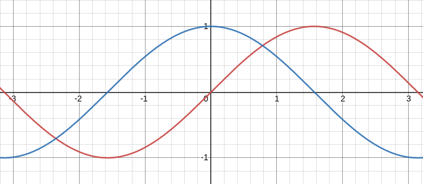

# Cosine, Sine, and Tangent Functions

We'll explain here how the functions `dz_cos`, `dz_sin` and `dz_tan`
from `<lib/dzmath.h> are coded for fast & accurate trigonometry
functions.

This document has been re-organized and revised from the entries
at [My Thoughts' Document](../thoughts.md).

> NOTE: It still has to be organized...


## MUST REORGANIZE

- I should be working on the game-state system, but I came across a way to quickly
  calculate `cos` & `sin` on the N64. The way it works is by using the formula
  for an approximate value of `cos x` by Bhaskara I--an Indian mathematician who
  got us this little formula in the 7th century.
  It is as follow:
  ```
  (PI^2 - 4(x^2)) / (PI^2 + x^2)
  ```
  But it's only quite accurate when x is of [-PI/2;PI/2] (when `cos x` is positive).
  So in order to get a full usable `cos` function, I must find to mirror
  the values of [PI/2;3PI/2] to become of [-PI/2;PI/2] and multiply by `-1`.
  It's like using just the half of the `cos` function graph (which is technically
  what we're trying to do)!

- Huh? BAMS? Binary Angular Measurement System? Seems pretty nice though...
  Not having to deal with this much floating or fixed points...

- YO I CAN MULTIPLY BY TWO JUST BY SHIFTING BITS!
  LIKE: `x * 2` IS THE SAME AS `x << 1`! AND `x / 2` IS THE SAME AS `x >> 1`
  - Never mind I was being delusional.
  - NO ACTUALLY I WASN'T BEING DELUSIONAL I JUST CHECKED!
  - It looks like it works this way: we have `x << m` or `x >> m`
    where `x` is the number we want to divide/multiply,
    and `m` is the divider/multiplier. A condition is `m % 2 = 0`
    (`m` must be divisible by 2).
    Then doing this `x << m` actually means this: `x * 2m`.
    Or for division: `x >> m` means `x/(2m)`.
    For example, doing `4 << 1` means `4 * 1*2 = 8` so it multiplies by 2.
    Or doing this: `8>>1` means `8 / (1*2)`.
    And as I said, it works for every `m` as long as `m % 2 = 0`;
    `4 << 2` means `4 * 2*2=16`, or `64>>2` means `64/(2*2)=16`.
  - Looks like the formula is actually:
    `x << m` means `(x * 2m)(m/2)`.
  - Alright, never mind. There isn't a rule for this.
    Oh well. At least I got a fast way to multiply and divide by 2.

- The Binary Angle Measurement System (BMAS), or also shortened
  to BINANG (Binary Angle)is pretty awesome!
  - A few BINANG (Binary Angle) notes:
    - 0x0000 = 0°
    - 0x4000 = 90° (because 0x4000 = 16384, and 16384/65536 × 360° ≈ 90°)
    - 0x8000 = 180° (32768/65536 × 360° = 180°)
    - 0xC000 = 270° (49152/65536 × 360° = 270°)
    - 0xFFFF = 359° (360° is 0°)

  - [WARNING: this part is wrong ]
    What I have understood about how BINANG is written, is that for `0xP000`
    `P` is how many twelveth (1/12) of a circle the angles represents.
    For example, knowing that 1/12 of a circle in degrees is 45°, `0x1000`
    means 45°. `0x3000` means 135° (45 * 3).
    But that's for a global idea by rounding to 1/8 of a circle.

  - The 2 highest bits in the BINANG represent the quadrant (quarter of a circle) we're one:
    - `00`: Quadrant 1 (0°-90°)
    - `01`: Quadrant 2 (90°-180°)
    - `10`: Quadrant 3 (180°-270°)
    - `11`: Quadrant 4 (270°-360°)

  - Based on our previous "Quadrant IDs" (not a correct name but meh),
    it means that Quadrants 1 & 4 are positive (on the right of the vertical axis
    a.k.a on the right of the 90° line), and Quadrants 2 & 4 are negative.
    I'm too lazy & stupid to explain in text like this so here is something I drew:

    

    This image represents the 2 highest bits of any BINANG for each Quadrant
    (as noted above). After bit-shifting to the left (multiplying by 2),
    we get new bits. And after an XOR between the original and multiplied BINANG,
    we get some interesting bits: the highest bit (bit 15) can now tell us
    if we're working on a quadrant who's `cos` should be negative, which technically
    translates to the `x` position in the circle being negative.

    And that's pretty magic! So we can now know if we should were working in
    a negative quadrant by doing:
    ```c
    // angle in BINANG!
    bool negativeQuadrant = ((angle ^ (angle << 1)) & 0x8000) != 0;
    ```
    Because if the highest bit is 0, then it means that `cos(angle) > 0` (positive).
    But if the highest bit is 1, then `cos(angle) < 0`. Because a bit of 0 means
    means we're on the right quadrants, and a bit of 1 means we're on
    the left quadrants. 

  - So, what was supposed to be a simple implementation of that Indian's formula
    is a bit of a brain-ache. Soooo, I think I'll focus on the game-states for now.

- Alright, back to Bhaskara I's approximation of cosine: I IMPLEMENTED IT!
  LIKE: IT WORKS! FOR REAL!
  * "Is it correct?""
    <br/> I don't know...
  * "Is it fast?""
    <br/> Probably???

  But I heard it's fast so... Oh! And using Bhaskara's I cosine approximation,
  I can calculate sine by doing:
  ```
  sqrt(1 - cos(x)²) = sin(x)
  ```
  So that's a win. Because apparently, a square-root on the N64 is as expensive
  as a division, so that's cool.

- Now, I have to explain how things are done:
  using this code snippet from Kaze Emanuar:

  

  We have little background about what's happening in this code-snippet,
  but there are things you can understand with my previous thoughts-entries.
  And note that I have modified a few things in there to boost performance
  and because there are some stuff that Kaze has done that are specific
  to his code-based and... "coding-ethics"...

  * So, the `flipsign` has already been explained.
  * `angle = 0x8000 - angle` so if we're working on the left half of the *(imaginary)*
    circle, it is translated to the right circle, because the formula used (Bhaskara I)
    [TODO: continue the explanation]

- Alright. I don't really know what to code for now and I don't really wanna
  think too much about it. So let's do some **DOCUMENTATION!!!**
  I think I'll do that in separate documents. But for now I'll just throw
  my *documented* thoughts here.

- So, the thing I wanna explain the most for now is my Sine, Cosine,
  and Tangent functions. Fun, important fact: all of these functions
  are based on my cosine function. Let me explain:
  to calculate the cosine value of an angle, my function uses Bhaskara's I
  Cosine approximation which is VERY accurate as long as the angle we're plugging in
  is of [-pi/2;pi/2] (i.e the right half of the circle), or else the resulting
  value would make no sense. Here is a graph that compares the normal cosine function
  used almost everywhere in red with Bhaskara's approximation in blue:

  

  As you can see, Bhasara's Cos approximation is EXACT as long as x is between
  `-pi/2` and `pi/2` (we're using radians). But any other value would result in,
  well, incorrect results.
  > So from now on, the definition of Bhaskara's cosine approximation function
    which is [-pi/2;pi/2] will be referred to as `Db`.

  How are we supposed to get a fully working cosine function then? Great question!
  It's quite simple, actually: for any given angle in radians `x`, we check if it's
  gonna give us a negative or positive cosine value. Because as we've seen in
  the previous graph, for any `x` of `Db`, the resulting *correct* cosine value of
  Bhaskara's approximation will be positive. Thus, to get the rest of the function,
  we just mirror the positive part of the function vertically, offset it to the right
  or left (based on the value of `x`) and voila! A correct cosine function!

  > The red graph is the original approximation of Bhaskara.
    The orange & green graphs are Bhaskara's approximation but
    offseted to replicated the original cos graph which is
    the dotted graph in blue.

  

  So, if `x` is of [pi/2;3pi/2] or [-pi/2;-3pi/2] (both mean the left part
  of the circle, or the red area in Figure TC-1), we just plug `x + (half circle)`
  into Bhaskara's approximation, then make the result negative
  (in a context in which we use radians for angles, meaning `x` is also in radians,
  `half circle` would mean `pi`).
  This means that we horizontally mirror the given `x` that would result in
  a negative Cosine to get the same cosine value but positive, then we can
  just make it negative. What's helpful here is that we're using one half
  of a circle to calculate the cosine of the angle `x`.
  Here is a simple drawing that showcases a "Trigonometric Circle":

  > The blue lines & arrows mean rotating negatively (with a negative angle).
    The white ones mean rotating positively (positive angle).
    The angles start rotating from (1, 0) on the circle's grid.

  

  > Figure TC-1

  So as you can see, we can rotate positively until `angle = pi/2`
  or negatively until `angle = -pi/2`.
  The imaginary line resulting from the angle (in radians) from
  the x-axis will hit the circle at point A who's X (horizontal) position
  on that circle's grid would be `cos(angle)` and Y (vertical) position
  would be `sin(angle)`.

  

  > Figure TC-2

  So plugging an `x` of `Db` would result in a positive `cos(x)` that
  would represent a point on the right of the circle (in the right green area
  as shown in Figure TC-1).
  So if a `x` is given other than the range `Db`, then it means that `cos(x)`
  will be negative.
  But Bhaskara's Cosine can't give a correct negative `cos(x)`,
  which translates to not accepting any `x` not in the range `Db`.
 
  **THUS; THE SOLUTION!** We write a function that takes any angle--whether
  it results in a positive or negative cosine value.
  If the given angle would result in a negative value, then we take
  the angle as if it was on the other half of the circle (as shown in Figure TC-2)
  but we remember that the result should be negative (by setting
  a boolean variable `flipsign` to `true` for example).
  Then once the correct cosine value is calculated, we flip the result's sign
  if `flipsign` is `true`.
  Of course, if `x` is of `Db`, all of these would be kinda pointless because
  plugging that `x` directly would give a correct cosine value.

  - And that's technically how Bhaskara's cosine approximation can be turned
    into a fully accurate (i think) cosine function. But now, how do we get
    our Sine & Tangent Functions? Pretty easy!

  - **How Sine & Tangent are calculated**:
    * **Sine**: We got 2 ways to calculate a sine value:
      - Because `cos(x)` is "the horizontal distance between the circle's origin
        and the point resulted by the line with angle `x` colliding
        with the circle" (well that's pretty confusing), and `sin(x)`
        is the same thing but vertically. And knowing that our circle's radius
        is always `1` (well, it's not called a "unit circle" for nothing),
        this means that using Pythagoras' Theorem:
        ```
        dist_x^2 + dist_y^2 = radius^2
        ```
        Which translates in our case to:
        ```
        (cos(x))^2 + (sin(x))^2 = 1
        ```
        So that means that to get the value of `sin(x)` we do:
        ```
        sin(x) = sqrt(1 - (cos(x))^2)
        ```
        That's the universal way of doing it, but you'll notice that we have
        to <u>square</u> `cos(x)`, <u>subtract</u> the result from `1`,
        then get the square root of that subtraction; that's too much!
        And using this every frame wouldn't be the best approach if we had...
        "another way" of doing it...
      - BAM! Looking at the following graph (Figure TC-3), we can see that
        Sine's graph (in red) and Cosine's graph (in blue) are identical!
        The only difference is their X position on the grid:

        

        > Figure TC-3

        The X difference between them is of `pi/4`. So we can calculate `sin(x)`
        by doing `cos(x + pi/4)` OR we can also do `cos(x - pi/2)`.
        Both make Sine's graph be identical to Cosine's
        (open up [Desmos](https://www.desmos.com/calculator) and try!).

      Now, which way is faster: calculating `cos(x)`, squaring it, subtracting
      the result from 1, then get the square root? Or just calculate
      the cosine value with an addition? The obvious choice is the second option,
      as its cost is the cost a cosine calculation + addition.

    * **Tangent**: the only way I can think of is using the well known
      `sin(x) / cos(x) = tan(x)`. It's as simple as that. And it has the cost
      of a sine calculation (cos calculation + addition), a cosine calculation,
      and a division. Boom: we're done!

  The twist with my trigonometric functions is that, compared to *normal*
  trig-functions that take angles in radians, mine takes angles in
  binary angles! Yep! With a 0-65535 range! The benefit that I've noticed
  about using binangs is that I can manipulate them with bit-shifting
  (`x >> 1` divides by 2 & `x << 1` multiplies by 2), and I can replace
  PI with 32768 (half of 65536)--this simplifies calculations **SO MUCH**!
  Also; I don't need to calculate as many values anymore!
  For example, with Bhaskara's cosine approximation, I had to do this
  (for `x` is of `Db`):
  ```
  (pi^2 - 4(x^2)) / (pi^2 + x^2) = cos(x)
  ```
  But because I'm using binary angles, I can replace this with:
  ```
  (0x8000^2 - 4(x^2)) / (0x8000^2 + x^2) = cos(x)
  ```
  **AND** because binangs are so beautiful, I can pre-compute the squared
  value of `0x8000`:
  ```
  (0x40000000 - 4(x²)) / (0x40000000 + x^2) = cos(x)
  ```

  We got rid of an infinite float, PI (though I have a macro for
  its value with 20 fraction digits of precision), and of a squaring
  operation (multiplying).

  Isn't that nice!? Like, that's so awesome!

  And I think that's it for my trigonometry functions. I am very proud
  and thankful to God that they are working correctly.
  And I had a lot of fun learning everything that revolves around them.
