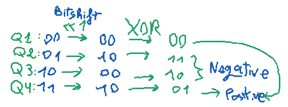
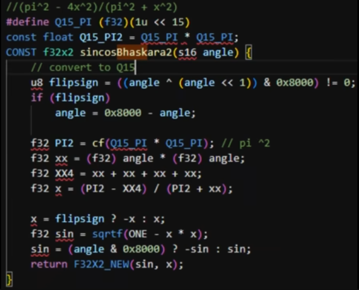
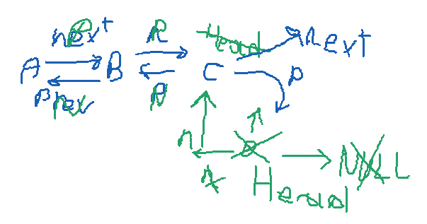

# Thoughts

Welcome to this unorganized "entries-based" "devlog". Really, it's just a place
where I throw my thoughts while I'm developing this project. This documents also
contains some pretty interesting stuff for N64 & average devs (i think).

> NOTE: this document started as a todo list. So you'll notice in the first
  entries tasks instead of thoughts and notes.

- [DONE] Implement an actor system (heavily inspired from HackerOoT)
- Learn how to display a 3D plane with Tiny3D
- [DONE] Learn how to display a 3D model
- Find the most efficient way to store 3D Objects:
  `.t3dm` (Tiny3D) or raw `.c` files like in ZeldaOoT.
  - If I end up choosing the second option (very improbable),
    I'll ~~definitely~~ probably would need to write my own thing
    to display 3D graphics.
- Add my `compile_flags.txt` to [`docs/`](./) for people to have correct
  includes if using clangd and maybe note some NeoVim-C stuff
  for NVim users.
- I should implement `PlayState` & `GameState` so I can handle the game loop correctly.
- Having some functions for the controller (`joypad_*` functions) is nice n' all,
  but I don't know if calling those functions every time I need some input
  is smart, efficient, and more importantly: PERFORMANT! So instead, I might
  make some `Input` type that will have the essential stuff we need.
  Or rather, all the data that those functions provide would all be neatly
  stored in one data structure. So game states or actors could store a pointer
  to that input.
- With how currently almost all my memory allocations are done through `malloc`,
  I think fragmentation is a bit more likely to happen (though I have been told
  that it's not likely to happen). I found `libdragon-extensions`'s implementation
  of a "Memory Pool" pretty interesting. It's downside though is the fact that
  after initialization; a memory pool cannot be freed. ***Memory Leak~!***
  But I have to admit that this implementation is much faster than `malloc`,
  because it reserves a space in memory using `malloc` only once
  (when initializing the memory zone). When allocating using its
  `mem_zone_alloc` function, the only thing happening is incrementing its
  position pointer by the new allocation's size. That's much cheaper than
  `malloc` especially in a game-loop when run ever frame.
  I should take inspiration from that `MemZone` implementation.
  Its best use cases are when making, for example, a pool for a maximum
  of *n* actor. But with my current implementation (actors chained with
  `next` & `prev` pointers as a doubly-linked list), actors can be allocated
  anywhere (probably...). And as long as they're not spawned every frame,
  thus using `malloc` every frame, it's not that bad! And on top of that,
  unlike the memory zone implementation, I can allocate as much actors
  as I want as long as I have enough RAM; meaning that if some level is
  very small (for example) and for some :sparkles: ***magical reasons*** :sparkles:,
  the game is currently using very little RAM, I can populate the level
  with a **LOT** of actors.
  But again, I should find a way to avoid fragmentation...
  - Maybe I could "reorganize" the memory on load times? Like, for example:
    there's some time where the player won't be bothered with some freezing
    or stuttering (for example when loading). At that time, we could
    *try* to reorganize the memory so all the free fragments and spaces
    are put to the end of memory and all allocations pushed back to leave
    no space in between. Nice idea but how do I implement such a thing?
    How is the game supposed to recognize when a space memory is free
    or if it's just some coincidentally placed zeros? Gotta think
    of a solution...
  - After some thinking, I think an actor pool WOULD be pretty useful.
    Like, when loading a level, there's almost definitely going to be
    some actors in that level. Thus, reserving a pool using that memory zone
    implementation for the actors might be nice, but **NO!**
    Because after reflection:
      * I got no way to free that memory pool later.
        *"But AKTCHUALLY: the actors are almost always gonna
        be loaded! Like, we're always gonna be in a level except
        in the few times when they'll be some UI like a title screen
        or something"*. And to that I say: ***"nuh uh".***
        Because: that's giving up memory to an actor pool
        in case I wanna do something cool that doesn't require the actors.
  - Again, the doubly-linked list of actors is pretty nice so far,
    and my only concern is fragmentation. My game is too small for now
    for me to worry about fragmentation.
    But in the future, I'd like to have as much memory available as possible
    with the free memory being one big free area instead of being little
    fragments of free memory scattered across the RAM.

- As I was gonna wreck my head to try implementing states, I found that HackerOoT's
  source code provides a "Sample State" which is just a state example code!
  Ah, yes! This makes understanding states in ZeldaOoT much easier!
  Thus, making implementing that easier too!

- I should probably define DEBUG_FEATURES

- Bruh Tiny3D's matrix functions are expensive. It's like there are too much interfaces.
  The `T3DMat4FP` functions are manipulations with a `T3DMat4` then converted to `T3DMat4FP`.
  Bruh.

- I got two ideas for the game-state system:
  1.  Replicate the HackerOoT game-state system. and that includes using an overlay table
      which (I think) lives in memory for the whole game's life. And so to switch
      states i.e set the next state, the macro `SET_NEXT_GAMESTATE` must be used.
      And so the logic that handles the actual state switch (making the game use/run
      the new state) works by comparing the new current state's init func that was set
      by `SET_NEXT_GAMESTATE`. And it gets the overlay info of the correct state
      based on that init func.
  2.  **Make my own.** And my idea is having a single function called something like
      `GameState_SetNext` which takes a `GameState*` and a game-state id (`u8` because
      there aren't this much states and I don't think that I'll use more than 255 states
      for a single game...). But first, I still gotta understand how HackerOoT handles
      game-states so I can be able to see what I can remove, what I can recycle,
      and what I can improve.

- I should be working on the game-state system, but I came across a way to quickly
  calculate `cos` & `sin` on the N64. The way it works is by using the formula
  for an approximate value of `cos x` by Bhaskara I--an Indian mathematician who
  got us this little formula in the 7th century.
  It is as follow:
  ```
  (PI^2 - 4(x^2)) / (PI^2 + x^2)
  ```
  But it's only quite accurate when x is of [-PI/2;PI/2] (when `cos x` is positive).
  So in order to get a full usable `cos` function, I must find to mirror
  the values of [PI/2;3PI/2] to become of [-PI/2;PI/2] and multiply by `-1`.
  It's like using just the half of the `cos` function graph (which is technically
  what we're trying to do)!

- Huh? BAMS? Binary Angular Measurement System? Seems pretty nice though...
  Not having to deal with this much floating or fixed points...

- YO I CAN MULTIPLY BY TWO JUST BY SHIFTING BITS!
  LIKE: `x * 2` IS THE SAME AS `x << 1`! AND `x / 2` IS THE SAME AS `x >> 1`
  - Never mind I was being delusional.
  - NO ACTUALLY I WASN'T BEING DELUSIONAL I JUST CHECKED!
  - It looks like it works this way: we have `x << m` or `x >> m`
    where `x` is the number we want to divide/multiply,
    and `m` is the divider/multiplier. A condition is `m % 2 = 0`
    (`m` must be divisible by 2).
    Then doing this `x << m` actually means this: `x * 2m`.
    Or for division: `x >> m` means `x/(2m)`.
    For example, doing `4 << 1` means `4 * 1*2 = 8` so it multiplies by 2.
    Or doing this: `8>>1` means `8 / (1*2)`.
    And as I said, it works for every `m` as long as `m % 2 = 0`;
    `4 << 2` means `4 * 2*2=16`, or `64>>2` means `64/(2*2)=16`.
  - Looks like the formula is actually:
    `x << m` means `(x * 2m)(m/2)`.
  - Alright, never mind. There isn't a rule for this.
    Oh well. At least I got a fast way to multiply and divide by 2.

- The Binary Angle Measurement System (BMAS), or also shortened
  to BINANG (Binary Angle)is pretty awesome!
  - A few BINANG (Binary Angle) notes:
    - 0x0000 = 0°
    - 0x4000 = 90° (because 0x4000 = 16384, and 16384/65536 × 360° ≈ 90°)
    - 0x8000 = 180° (32768/65536 × 360° = 180°)
    - 0xC000 = 270° (49152/65536 × 360° = 270°)
    - 0xFFFF = 359° (360° is 0°)

  - [WARNING: this part is wrong ]
    What I have understood about how BINANG is written, is that for `0xP000`
    `P` is how many twelveth (1/12) of a circle the angles represents.
    For example, knowing that 1/12 of a circle in degrees is 45°, `0x1000`
    means 45°. `0x3000` means 135° (45 * 3).
    But that's for a global idea by rounding to 1/8 of a circle.

  - The 2 highest bits in the BINANG represent the quadrant (quarter of a circle) we're one:
    - `00`: Quadrant 1 (0°-90°)
    - `01`: Quadrant 2 (90°-180°)
    - `10`: Quadrant 3 (180°-270°)
    - `11`: Quadrant 4 (270°-360°)

  - Based on our previous "Quadrant IDs" (not a correct name but meh),
    it means that Quadrants 1 & 4 are positive (on the right of the vertical axis
    a.k.a on the right of the 90° line), and Quadrants 2 & 4 are negative.
    I'm too lazy & stupid to explain in text like this so here is something I drew:

    

    This image represents the 2 highest bits of any BINANG for each Quadrant
    (as noted above). After bit-shifting to the left (multiplying by 2),
    we get new bits. And after an XOR between the original and multiplied BINANG,
    we get some interesting bits: the highest bit (bit 15) can now tell us
    if we're working on a quadrant who's `cos` should be negative, which technically
    translates to the `x` position in the circle being negative.

    And that's pretty magic! So we can now know if we should were working in
    a negative quadrant by doing:
    ```c
    // angle in BINANG!
    bool negativeQuadrant = ((angle ^ (angle << 1)) & 0x8000) != 0;
    ```
    Because if the highest bit is 0, then it means that `cos(angle) > 0` (positive).
    But if the highest bit is 1, then `cos(angle) < 0`. Because a bit of 0 means
    means we're on the right quadrants, and a bit of 1 means we're on
    the left quadrants. 

  - So, what was supposed to be a simple implementation of that Indian's formula
    is a bit of a brain-ache. Soooo, I think I'll focus on the game-states for now.

- It really pains me to say this, but I'll have to stick with ZeldaOoT's approach
  at working with game-states...
  I tried implementing my own thing. But after finding out that a game-state overlay table
  that consists of, let's say, 5 states would be around 145 bytes, it felt like I was just
  begging for bytes (you know that meme of Squidward begging for pennies?).
  - The issue I encountered is that I had to know what size & what life functions had to be
    used to allocate for a new state and start working with it.
    I could do this with a few functions, but I would need:
    a function to set the next game-state's life functions based on a game-state ID,
    and a function to get the size of a game-state based on its ID.
  - Wait... That's it? I technically just need these 2 functions! And on top of that,
    loading a new game-state can't be annoying because it would probably display
    a loading screen or something (the player will wait for another state to load like
    he knows is done in any other game). So I save up around 87 bytes which could have
    been used for an overlay table for 3 game states.
  - So, TL;DR: I have the choice between keeping a game-state overlay table in memory,
    or just loading the game-state on-the-go when a state-switch or new state is requested
    which saves some memory but adds more code.

- Alright, back to Bhaskara I's approximation of cosine: I IMPLEMENTED IT!
  LIKE: IT WORKS! FOR REAL!
  * "Is it correct?""
    <br/> I don't know...
  * "Is it fast?""
    <br/> Probably???

  But I heard it's fast so... Oh! And using Bhaskara's I cosine approximation,
  I can calculate sine by doing:
  ```
  sqrt(1 - cos(x)²) = sin(x)
  ```
  So that's a win. Because apparently, a square-root on the N64 is as expensive
  as a division, so that's cool.

- Now, I have to explain how things are done:
  using this code snippet from Kaze Emanuar:

  

  We have little background about what's happening in this code-snippet,
  but there are things you can understand with my previous thoughts-entries.
  And note that I have modified a few things in there to boost performance
  and because there are some stuff that Kaze has done that are specific
  to his code-based and... "coding-ethics"...

  * So, the `flipsign` has already been explained.
  * `angle = 0x8000 - angle` so if we're working on the left half of the *(imaginary)*
    circle, it is translated to the right circle, because the formula used (Bhaskara I)
    [TODO: continue the explanation]

- I have just finished my own game-state system. It has a bunch of concepts inspired
  by ZeldaOoT's game-state system, but what I did on my own is how states
  are managed and how to switch/change states.
  It's like 10:30PM, I am tired, so I might explain this tomorrow.
  It's, uhh, the 20th of January 2026. This is a nice date. I have an N64 game
  running my own actor & game-state system, with a lot of "from-scratch" things in it.
  I'm also pretty proud with my super-fast cosine & sine functions.
  > I am worried I will forget how all of this state-thingy-system works tomorrow.
    But it is fairly easy to understand for now.

- I just had a thought while checking my actor handling codes: we can initialize
  a new `ActorContext` with `ActorContext_Init`. But can we destroy it?
  Do I currently have a way to free all actors? Uh oh... Memory leaks...!
  - Alright I tried coding something simple that iterates over the actors
    in the actors' chain and free them. I don't know if it actually works,
    but I'm pretty tired as I said. Game-state system done, actor system too I guess,
    and this `ActorContext_Destroy` should be a-ok based on this little doodle
    I did that cannot be understood neither by you nor me tomorrow, I'm sure.

    

- Alright, we're yesterday's tomorrow now, and I must explain how my game-state
  system works. But I am also tired right now (it's exactly 19:44).
  But I'll a brief explanation:
  - We declare a global "master state" called `gMasterState` which is like a big-boss
    that decides the fate of the state-system.
    [TODO: continue]

- Alright, I'm lazing off about explaining my code, but right now I have a slightly
  bigger issue: my cosine & sine functions use BINANGs. But my `PosRot` type uses... idk.
  Like, what does Tiny3D even use to represent rotations? What unit?
  But anyways: the problem is exactly that! There isn't a universal rotation/angle unit
  in my code-base! Will I have to keep converting stuff to stuff? Nuh uh!
  I gotta find a solution...

- Ah, also: I implemented a Play State and a Camera. But I just realized that my camera
  can't use the `rot` from its `PosRot` because the camera's rotation is calculated
  using its `at` coordinates. So I don't know if I should get rid of the `PosRot`
  and just add the camera's position with a `Vec3`, or implement something
  to apply the rotation we give to the camera. Either way, it's 23:31 and yes:
  I am kinda tired.

- Little reminder to myself to explain the following things:
  * The Game-State System
  * The Camera
  * My Cosine & Sine functions
  * Write a more thorough explanation of the Actor System.

- I should start trying to replace Tiny3D's stuff that use floats with BINANGS.
  Or at least minimize the use of floats for my rotations.

- I should also start classifying what's in this document into other more
  detailed documents. And mark the notes here in, well, [notes](./notes.md).

- Imagine fighting your camera's code because your view or actors are appearing
  all squished, until you realize your emulator was in 16:9 ... Welp.
  Just had to set it back to 4:3 !

- The codename of this project has been `DZLink`. But I think I'll also refer to it
  as `DZLink64`. Oh, and it can be referred to as a game, and maybe more an engine.
